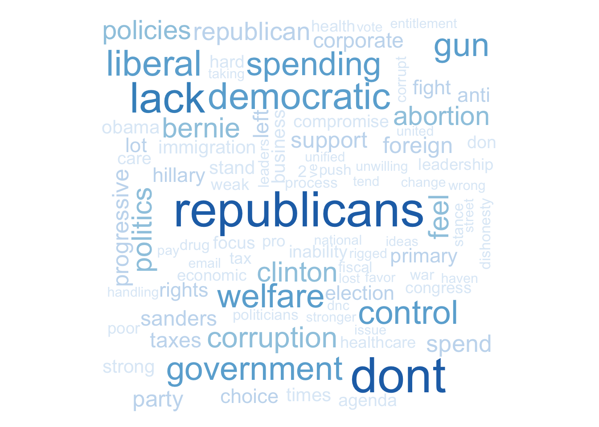
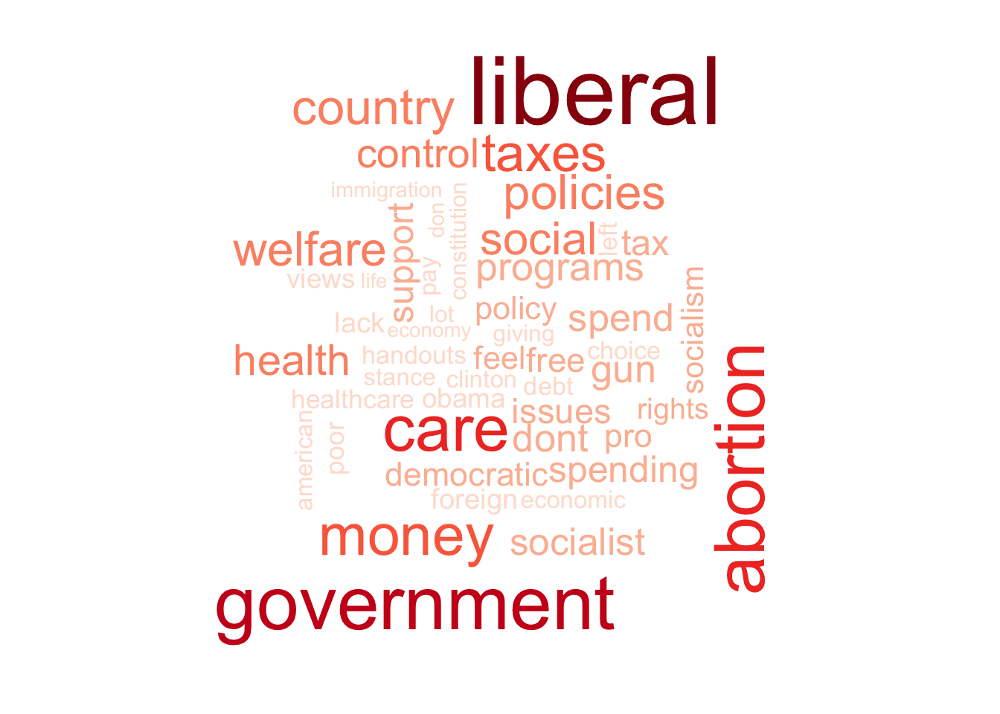
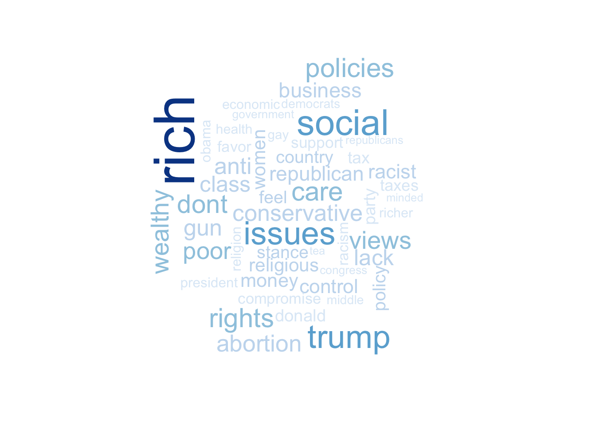
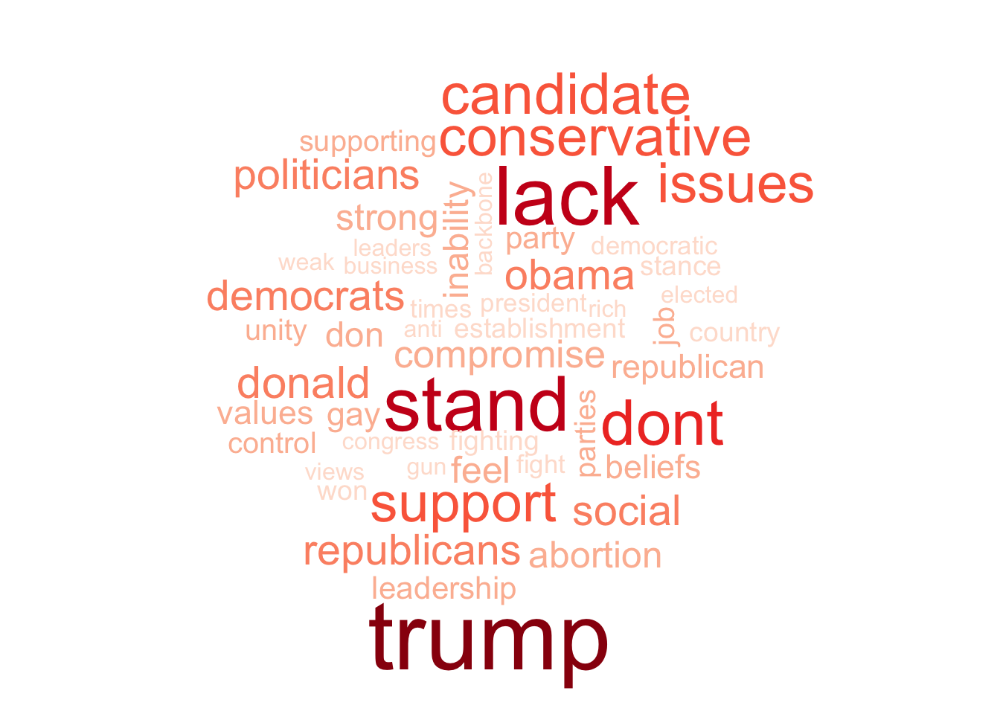

```{r setup, include=FALSE}
knitr::opts_chunk$set(echo = FALSE, message = FALSE, warning = FALSE, cache = FALSE, fig.path='Figs/', eval.after = 'fig.cap')
library(here)
library(tidyverse)
library(magrittr)
library(tidytext)
library(wordcloud)
library(RColorBrewer)
```


```{r data}
d <- full_join(read.csv(here("datasets","demdislike.csv")),
               read.csv(here("datasets","repdislike.csv"))
               )
d$dislikeDems %<>% str_replace_all("[[:punct:]]| like|like |don.t | people|pro | party|party ", " ") %>% tolower() 
ddis <-  unnest_tokens(d, word, dislikeDems)

d$dislikeReps %<>% str_replace_all("[[:punct:]]| like|like |don.t | people|pro | party|party ", " ") %>% tolower() 
rdis <-  unnest_tokens(d, word, dislikeReps)

set.seed(45)
```

<center>

# What do you dislike about Democrats?

```{r dislikedems-rephatesdems, fig.cap=cap}
ddis %>%   
  filter(rephatesdems == 1) %>%  
  anti_join(stop_words) %>%
  count(word) %>%
  with(wordcloud(word, n, colors=brewer.pal(8, "Reds"), max.words = 100))

cap <- "Republicans who dislike Democrats"
```


```{r dislikedems-demhatesreps, fig.cap=cap}
ddis %>%   
  filter(demhatesreps == 1) %>%  
  anti_join(stop_words) %>% 
  count(word) %>%
  with(wordcloud(word, n, colors=brewer.pal(8, "Blues"), max.words = 100))

cap <- "Democrats who dislike Republicans"
```


# What do you dislike about Republicans?
```{r dislikereps-rephatesdems, fig.cap = cap}
rdis %>%   
  filter(rephatesdems == 1) %>% 
  anti_join(stop_words) %>% 
  count(word) %>%
  with(wordcloud(word, n, colors=brewer.pal(8, "Reds"), max.words = 100))

cap <- "Republicans who dislike Democrats"
```

```{r dislikereps-demhatesreps, fig.cap = cap}
rdis %>%   
  filter(demhatesreps == 1) %>% 
  anti_join(stop_words) %>%
  count(word) %>%
  with(wordcloud(word, n, colors=brewer.pal(8, "Blues"), max.words = 100))

cap <- "Democrats who dislike Republicans"
```


### What do you dislike about the Democratic party?
{ width=40% } { width=40% }

### What do you dislike about the Republican party?
{ width=40% } { width=40% }

(ANES V161101 V161106)
</center>
```{r 2x2}


```


```{r dislikedems2, include=FALSE}
library(reshape2)
ddis %>%
  inner_join(get_sentiments("bing")) %>%
  count(word, sentiment, sort = TRUE) %>%
  acast(word ~ sentiment, value.var = "n", fill = 0) %>%
  comparison.cloud(colors = c("gray20", "gray80"),
                   max.words = 100)
```
